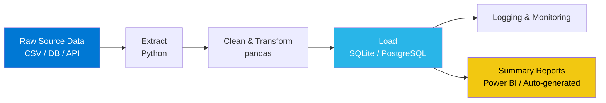

# 👋 Hi, I'm Zwavhudi Mudogwa

### 🚀 Aspiring Data Engineer | Python · SQL · Azure · Power BI

 

---

## 💡 About Me & 🎯 Current Focus

<table>
<tr>
<td width="50%" valign="top">

### 💡 About Me

- 🇿🇦 Based in South Africa
- 💻 Aspiring Data Engineer
- ☁️ Azure enthusiast
- 🐍 Python developer
- 🛢️ SQL specialist
- 📊 Power BI developer
- 📈 Background in data analysis, ETL pipelines & BI reporting

</td>
<td width="50%" valign="top">

### 🎯 Currently Learning / Building

- ☁️ Azure Data Factory
- 🛢️ PostgreSQL
- ⚡ Apache Spark
- 🔧 dbt
- 🌀 Airflow
- 🐳 Docker

</td>
</tr>
</table>

---

## 🛠 Tech Stack

**Languages**

**Data Analysis & ML**

**Data Engineering & Orchestration**

**Databases & Warehouses**

**Cloud & Infra**

**BI & Visualization**

**Tools**

---

## 🏗 Data Engineering Architecture

A simplified view of how I approach building a pipeline, using **[etl-sales-pipeline](https://github.com/Zwavhudi05/etl-sales-pipeline)** as the reference:

> Extract → clean → load → report, with logging at every stage so failures are visible, not silent.

---

## 🚀 Featured Projects

| Project | Description | Tech Used |
|---|---|---|
| [**etl-sales-pipeline**](https://github.com/Zwavhudi05/etl-sales-pipeline) | Modular Python ETL pipeline extracting, cleaning, and loading Superstore sales data into a SQLite warehouse, with automated logging and summary reports | Python, SQLite, ETL |
| [**Healthcare-Claims-Utilisation-Analysis**](https://github.com/Zwavhudi05/Healthcare-Claims-Utilisation-Analysis) | End-to-end BI solution analysing simulated medical aid claims, membership, and utilisation data — modeling cost drivers and detecting over-utilisation anomalies | T-SQL, BI, Data Modeling |
| [**statssa-crime-unemployment**](https://github.com/Zwavhudi05/statssa-crime-unemployment) | Analysis of South African crime and unemployment data across all nine provinces | Python, pandas, Seaborn, scikit-learn |
| [**epl-analytics**](https://github.com/Zwavhudi05/epl-analytics) | Analysis of 1,140 EPL matches (2020–2024) covering goal distributions, team performance, seasonal trends, and shot analysis | Python, pandas, Matplotlib |

---

## 🏆 Certifications

---

## 📊 GitHub Analytics

  
  

## 🔥 Streak

  

## 🏅 GitHub Trophies

  

## 📈 Activity Graph

## 🌍 Profile Summary

## 📊 WakaTime Coding Metrics

<!--
  To enable this section:
  1. Create a free account at https://wakatime.com
  2. Connect it to your code editor via the WakaTime extension
  3. Add a GitHub Action (search "waka-readme") to auto-update the block below
-->

### ⌛ Weekly Development Breakdown

<!--START_SECTION:waka-->
<!--END_SECTION:waka-->

## 🐍 Contribution Snake

<!--
  To enable this animation:
  1. Add the "platane/snk" GitHub Action to this repo (search "github contribution snake action")
  2. It will auto-generate and commit the SVG below to an "output" branch
-->

  

---

## 🌍 Connect With Me

  
  

<i>⭐ from <a href="https://github.com/Zwavhudi05">Zwavhudi05</a> — thanks for stopping by!</i>

